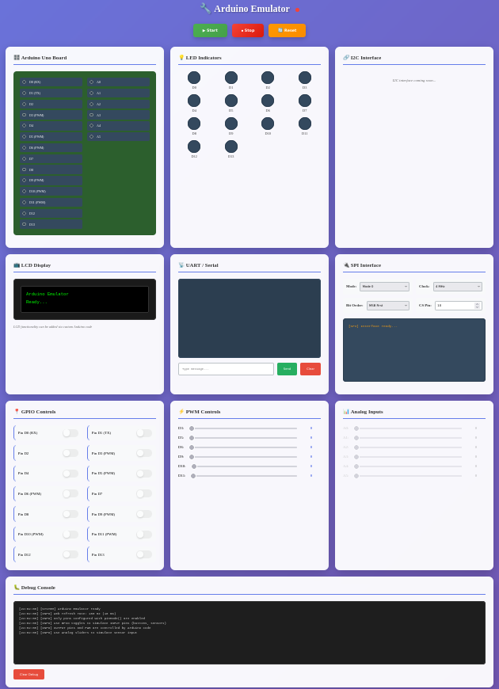
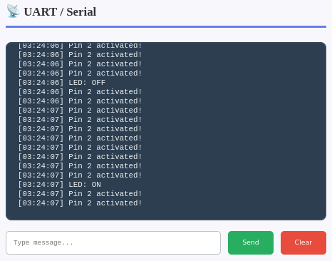

# 🤖 Arduino Emulator

Another Arduino emulator with its web interface for testing your `.ino` files without physical hardware or complex simulator. This tool allows you to test your Arduino code directly from your PC without any hardware setup, featuring an immediate human-machine interface to emulate GPIOs, communication. No complex wiring or physical setup required - just write your code and interact with virtual pins through a simple, direct web interface.

> **Note:** Default board is Arduino Uno (20 pins: D0-D13, A0-A5). Custom board configurations can be loaded via JSON files (see [Board Configuration](doc/board_config.md))



*Screenshot of the web interface launched from a Linux console (appearance may change as the project evolves)*

---

## ✨ Features

### 💻 Hardware-Free Development

- **Instant Feedback**: See results immediately on your web browser without uploading to physical boards.
- **Cost-Effective**: Develop and test without investing in multiple Arduino boards or components.
- **Educational Tool**: Perfect for learning Arduino programming without hardware constraints.
- **Simplified Testing**: No need for complex wiring or breadboard setups. You can use GDB directly.

### 🖥️ Simple & Direct Interface

- **Intuitive HMI**: Easy-to-use interface for interacting with virtual pins configured from your ino code.
- **Web Browser Interface**: Access the complete emulation environment directly in your web browser.
- **Direct Interaction**: Toggle GPIOs, adjust analog values, and monitor outputs with simple clicks.
- **No Complex Setup**: Skip complicated wiring and component connections.

### 🔧 Hardware Emulation

- **Arduino Lifecycle**: emulates the Arduino execution by calling `setup()` once at initialization, then repeatedly executing `loop()` at configurable frequency.
- **Digital I/O**: Complete `digitalWrite()`, `digitalRead()` support.
- **Analog I/O**: Full `analogWrite()` (PWM) and `analogRead()` (ADC 10-bit) emulation.
- **Pin Modes**: INPUT, OUTPUT, INPUT_PULLUP, INPUT_PULLDOWN, OUTPUT_OPEN_DRAIN with `pinMode()`.
- **PWM Pins**: 6 PWM-capable pins (D3, D5, D6, D9, D10, D11).
- **Analog Pins**: 6 analog input pins (A0-A5) with 0-1023 range.

### ⏱️ Timing Functions

- **millis()** and **micros()**: Real-time clock emulation.
- **delay()** and **delayMicroseconds()**: Accurate timing.
- **Timer callbacks**: Periodic interrupt simulation.

### 🔊 Audio Support

- **tone()**: Generate square wave tones at specified frequencies using SFML audio output.
- **noTone()**: Stop tone generation.
- **Real Audio Output**: Actual sound generation through system audio (requires SFML audio library).
- **Frequency Control**: Supports the full range of audible frequencies.

### 📡 Communication Protocols

- **Serial (UART)**: Complete Serial bus emulation: Serial.print(), Serial.read(), ... support.
- **SPI**: Complete SPI bus emulation (begin, transfer, end).
- 🔄 **I2C**: Coming soon.

### 🎛️ Board Configuration

- **Default Board**: Arduino Uno (20 pins: D0-D13, A0-A5)
- **Custom Boards**: Load custom board configurations via JSON files (see [Board Configuration](doc/BOARD_CONFIG.md))
- **Configurable**: Pin count, PWM pins, analog pins, and pin mapping

### ⚠️ Current Limitations

- 🔄 No I2C emulation (coming soon)
- 💾 No EEPROM support (coming soon)
- ⏱️ Timer uses system real time (not cycle-accurate)

---

## 🚀 Usage

Compile the whole project as described in the next section.

### 1️⃣ Download, compile and run the web interface

**Prerequisites:**

- C++17 compiler (g++ or clang++)
- SFML 2.5+ (for audio support)

On Debian/Ubuntu, install SFML:

```bash
sudo apt-get install libsfml-dev
```

From your Linux console, type the following lines:

```bash
git clone git@github.com:Lecrapouille/ArduinoEmulator.git --recurse-submodules
make download-external-libs
make -j8
```

### 2️⃣ Prepare your Arduino code (WIP)

Modify the `src/arduino_user.cpp` file to point to your `.ino` file:

```cpp
#include "../doc/examples/example.ino"  // Change this path
```

Compile again:

```bash
make -j8
```

You have several examples given in this [repo](https://github.com/arduino/arduino-examples) to test.

### 3️⃣ Launch the application

From your Linux console, launch the emulator:

```bash
./build/Arduino-Emulator [OPTIONS]
```

A message like this one, shall appear:

```bash
========================================
Arduino Emulator Web Interface
Board: Arduino Uno
Server address: 0.0.0.0
Server port: 8080
Arduino loop rate: 100 Hz (10 ms)
Web client poll rate: 200 Hz (5 ms)
========================================
Starting server...
Server started successfully!
Open your browser at: http://localhost:8080
Press Ctrl+C to stop the server
========================================
```

**Command Line Options:**

- -a, --address arg    Server address (default: 0.0.0.0)
- -p, --port arg       Server port (default: 8080)
- -f, --frequency arg  Arduino loop rate in Hz (1-100, default: 100)
- -b, --board arg      Board configuration JSON file

The `-f` option controls the Arduino `loop()` execution rate (max frequency). The web client will poll at 2x this frequency to capture all state changes. Lower frequencies reduce CPU usage but increase latency.

The `-b` option: Board configurations are given in this [boards](boards) folder.

**VSCode**

Alternatively, people with VSCode or Cursor IDE, can directly launch the debugger and run step by step the code. You can modify the [launch](.vscode/launch.json) file.

### 4️⃣ Open the web interface

Open your browser at `http://localhost:8080`

The interface allows you to:

- **Start/Stop/Reset** the simulation.
- **View pin states** (mode, value, PWM).
- **Simulate inputs** by changing pin values (digital, analog).
- **Serial Monitor** to see program output.
- **Send data** to Serial, I2C, SPI.

---

## 🌐 Web Interface Details

The web interface provides multiple interactive panels to display the Arduino Uno states and interact with it. Let describe each panel.

### ⏯️ Start, Stop and Reset buttons


The Arduino emulator starts in a stopped state. You need to:

- **Start**: Click to begin the simulation (runs `setup()` then `loop()` continuously)
- **Stop**: Pause the simulation (freezes the current state)
- **Reset**: Stop and reset all pin states to their initial values, then restart if it was running

### 🎛️ Arduino Board


Displays the state of all pins (D0-D13, A0-A5) with:

- Visual indicators for HIGH/LOW states
- Pin mode badges (INPUT, OUTPUT, INPUT_PULLUP, INPUT_PULLDOWN, OUTPUT_OPEN_DRAIN)
- Real-time LED indicators for digital pins

> **Pedagogical Note:** For educational purposes, pins are only displayed and enabled in the interface if `pinMode()` has been explicitly called in your Arduino code. This teaches the importance of proper pin initialization, even for INPUT pins.

### 💡 LED Indicators


The LED indicators (D0-D13) provide visual feedback:

- **OFF**: Pin is LOW (0V)
- **ON**: Pin is HIGH (5V)
- **Variable brightness**: For PWM pins, the LED brightness varies proportionally to the PWM duty cycle (0-255)

### 📍 GPIO Controls


Interactive toggles to simulate digital inputs:

- Emulate button presses and sensor readings.
- Only enabled for pins configured as INPUT with the `pinMode()` function.
- Disabled for OUTPUT pins or controlled by Arduino code (i.e. serial ...)

### ⚡ PWM Controls


Sliders for PWM-capable pins (D3, D5, D6, D9, D10, D11):

- Real-time PWM value display (0-255).
- Visual feedback on LED indicators.
- Monitor `analogWrite()` output.
- **Read-only**: Sliders are controlled by Arduino code and cannot be modified by the user.

### 📊 Analog Inputs


Sliders to simulate analog sensor readings (A0-A5):

- Range: 0-1023 (10-bit ADC).
- Real-time voltage display.
- Only enabled for pins used with `analogRead()`.

### 📡 UART / Serial Monitor



Serial communication terminal:

- View all `Serial.print()` and `Serial.println()` output.
- Send data to the Arduino (simulates Serial input).
- Timestamped messages.
- Clear button to reset the terminal.

### 🐛 Debug Console


Messages and debugging information from the emulator itself:

- Simulation status changes.
- GPIO toggle events.
- Analog input changes.
- Error messages.

## 🔌 REST API

All endpoints are accessible via HTTP:

### ⏯️ Simulation Control

- `POST /api/start` - Start the simulation
- `POST /api/stop` - Stop the simulation
- `POST /api/reset` - Reset the simulation

**Note:** POST requests must include `Content-Length: 0` if they have no body.

### 🎛️ Board Information

- `GET /api/board` - Get board configuration

  Response:

  ```json
  {
      "name": "Arduino xxx",
      "pwm_pins": [ 3 ],
      "pin_mapping": { "A0": 14 },
      "analog_only_pins": [ 20 ]
  }
  ```

- `GET /api/tick` - Get Arduino loop tick counter (lightweight state change detection).

  Response:

  ```json
  {"tick": 12345}
  ```

  This counter increments after each `loop()` execution. The web client uses it to detect when to fetch full pin states, avoiding unnecessary polling.

### 📌 Pin State

- `GET /api/pins` - Get the state of all pins (0-19)

  Response:

  ```json
  {
    "pins": {
      "0": {"value": 0, "mode": 0, "pwm_capable": false, "pwm_value": 0, "configured": true},
      ...
    }
  }
  ```

- `POST /api/pin/set` - Set a digital pin value (simulate input)

  Request:

  ```json
  {"pin": 2, "value": 1}
  ```

- `POST /api/pwm/set` - Set a PWM value for PWM-capable pins

  Request:

  ```json
  {"pin": 3, "value": 128}
  ```

- `POST /api/analog/set` - Set an analog pin value (simulate analog sensor)

  Request:

  ```json
  {"pin": 0, "value": 512}
  ```

  Note: `pin` is the analog pin number (0-5 for A0-A5), not the physical pin number.

### 📡 Serial

- `GET /api/serial/output` - Read Serial output (consumes the buffer)

  Response:

  ```json
  {"output": "LED: ON\n"}
  ```

- `POST /api/serial/input` - Send data to Serial

  Request:

  ```json
  {"data": "test"}
  ```

---

## 📦 Dependencies

- C++17
- [MyMakefile](https://github.com/Lecrapouille/MyMakefile) - Makefile macros
- [cpp-httplib](https://github.com/yhirose/cpp-httplib) - HTTP server
- [nlohmann/json](https://github.com/nlohmann/json) - JSON parser
- [cxxopts](jarro2783/cxxopts) - CLI parser
- [SFML](https://github.com/SFML/SFML) - Simple and Fast Multimedia Library

Dependencies are included in the `external/` folder. MyMakefile shall be included when git cloning recursively this project. Other third-parties are downloaded by MyMakefile with the command `make download-external-libs`. They are not installed on the operating system.
